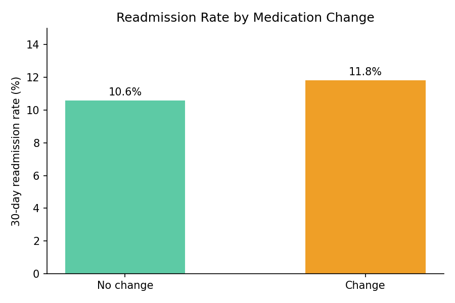
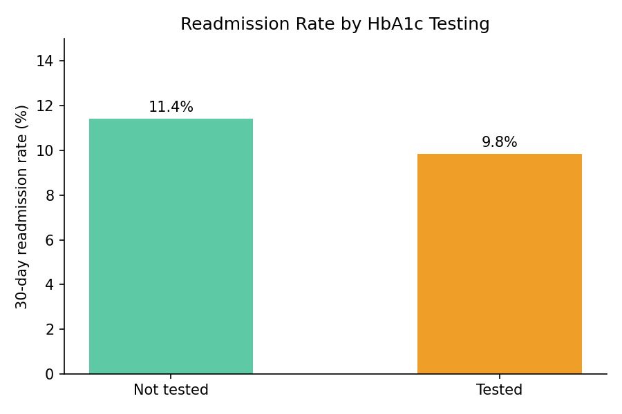
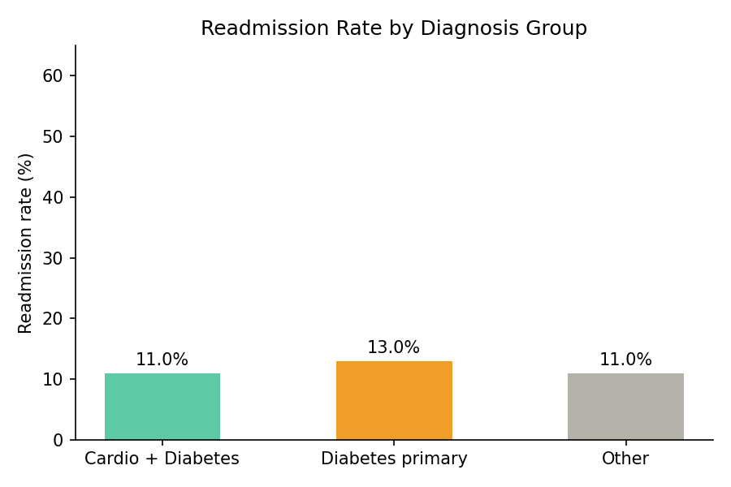

# Diabetes-Hospital-Readmission-Analysis

​## Project Overview:

​This project analyzes a dataset representing 10 years (1999-2008) of clinical care at 130 US hospitals. The primary goal is to identify factors that influence hospital readmission, a key quality metric in healthcare that affects both patient outcomes and hospital costs.

## Business Objective:
Hospital readmission within 30 days is a key quality metric in healthcare — it signals gaps in treatment, increases costs, and burdens both patients and providers. This project analyzes 10 years of clinical data from 130 US hospitals to identify which factors — medication changes, diagnostic completeness, emergency history, and comorbidity patterns — are associated with higher readmission risk in diabetic patients. The goal is to provide actionable, data-driven insights that can help healthcare providers improve discharge protocols and reduce preventable readmissions.

## Tools & Data:
​- **Dataset:** 100k+ diabetes clinical records - [Diabetes 130 US hospitals (Kaggle)] (https://www.kaggle.com/datasets/brandao/diabetes)
​- **Language:** Python 3.12
​- **Libraries:** Pandas (Data Cleaning/EDA), NumPy (Logic), Scipy.stats (Statistical Testing: Chi-square, Point-Biserial Correlation), Matplotlib/Seaborn (Visualization).

## Executive Summary (Key Insights):
**The "Change" Paradox:** Patients with therapy changes showed higher readmission rates (11.8% vs 10.6%). This suggests that a change in medication is a marker of disease instability, requiring closer follow-up.
​**HbA1c Testing Matters:** Patients who received an HbA1c test during their stay had a 1.58 percentage points lower readmission rate (9.8% vs 11.4%). This was statistically highly significant (p < 0.001).  
**Predictive Power of History:** The number of prior emergency visits is a stronger predictor of readmission than the length of the current hospital stay (r = 0.06 vs 0.04) - suggesting that chronic disease management history matters more than acute care duration. 
**Primary Diagnosis Impact:** Patients admitted with Diabetes as the primary diagnosis have a higher risk of return (12.98%) compared to those where diabetes was a secondary condition to cardiovascular issues (10.98%). 

​## Visual Highlights: 

​

​## Recommendations:
- **Care Transition for Therapy Changes:** Patients whose medications were adjusted during their stay should receive a follow-up call within the first 7 - 14 days after discharge to ensure stabilization.
​- **Standardize HbA1c Protocols:** Implement mandatory HbA1c testing for all diabetic patients if no test was performed in the last 90 days (based on the erythrocyte life cycle).
- **High-Risk Patient Flagging:** Patients with even one emergency visit in the past year should be automatically enrolled in a "Post-Discharge Support Program."
- **Diabetes Education Focus:** Since "Primary Diabetes" patients show the highest return rates, focus resources on Diabetes Self-Management Education (DSME) before discharge.
  
##Limitations 
- **Confounding Variables:** The analysis does not control for disease severity, number of prior hospitalizations, or hospital quality — factors that may independently explain the observed differences.
​- **Clinical Bias:** HbA1c testing might be a marker of overall higher-quality hospitals rather than the sole cause of lower readmissions.
​- **Data Age:** The dataset is historical; modern clinical protocols may differ, but the underlying statistical relationships remain a strong baseline for MedTech modeling. 
- **Single-variable analysis**: Each hypothesis tests one factor in isolation. In reality, readmission risk is multifactorial — the observed effects may diminish or disappear when controlling for other variables simultaneously (e.g., in a multivariate model).

